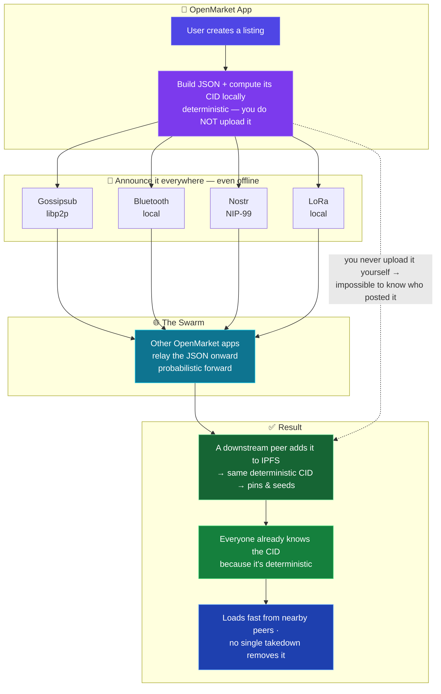

# OpenMarket

**A fully decentralized, optionally anonymous marketplace — no servers to seize, no company to pressure, no account to ban.**

OpenMarket is a marketplace that lives on its users' devices instead of a company's servers. There's
nothing to shut down, no one who can deplatform you, and no account that can be frozen. It shows you
listings from across the decentralized web — and lets anyone post their own — spreading peer-to-peer
over the internet, with listing **IDs (CIDs) propagating even over Bluetooth and LoRa when the internet
is cut**, so discovery never fully stops. Buyers and sellers connect directly and settle however they
choose.

It's not a company. It's a protocol and an app, released **MIT** and free to fork.

---

## Why it's different

- **Can't be shut down or deplatformed.** No central server, no operator, no chokepoint. The
  marketplace is the swarm of apps running it.
- **Starts full, not empty.** Most decentralized markets launch with nothing to browse and die there.
  OpenMarket reads listings *already published* across the Nostr marketplace ecosystem
  (**NIP-99 classified listings** — shopstr, Plebeian Market, and others), so there's plenty to see from day one. It's the
  **universal reader for decentralized markets** first, and your own publisher second.
- **Keeps spreading off-grid.** When the internet is throttled or cut, listing **IDs (CIDs) still
  propagate** over Bluetooth and LoRa — so discovery survives a shutdown and you queue listings to
  **resolve from IPFS once you're back online**. (Fetching a listing's content is an IPFS lookup that
  needs a connection; the *spread* of CIDs doesn't.) Other markets simply stop existing during a blackout.
- **You connect; you negotiate.** OpenMarket surfaces listings and puts buyer and seller in touch —
  payment and messaging happen *directly between them*, on whatever terms they agree. No middleman,
  no escrow account, no fees skimmed by a platform.
- **Optionally anonymous.** Browse and post without an account or identity if you want to.
- **Your keys, your device, your data.** Nothing phones home. Open source, forkable, yours.

## Starts full: how the listings get there

A new marketplace with no listings is useless, so OpenMarket doesn't start as one. It **aggregates**
the existing decentralized-market ecosystem: it pulls in NIP-99 product listings already on Nostr
relays and shows them alongside native OpenMarket listings, deduplicated and searchable locally.

When you post a listing, it propagates to the OpenMarket swarm **and** is published back out as NIP-99
— so the rest of the Nostr-market ecosystem sees it too. OpenMarket grows the commons instead of
competing with it.

## How it works



**In plain terms:** a listing is a tiny JSON file, and its address is a **CID computed from its
content** — *deterministic*, so the same listing always yields the same CID no matter who computes it.
You **compute the CID locally** (you don't upload it) and **broadcast the listing**; peers **relay it
onward** (friend-to-friend, probabilistically, so the origin is lost in the crowd), and at some point a
**downstream peer adds the JSON to IPFS** — producing that *same* deterministic CID and pinning/seeding
it. Even with no internet, that deterministic **CID keeps propagating over Bluetooth and LoRa**, so
discovery survives a blackout — you resolve the content from IPFS once you're back online. The key
trick: **you never upload it to IPFS yourself**, so there's no way to tell who originally posted it —
and because the CID is deterministic, everyone already knows exactly where to look the moment it lands.

## Build it yourself — the idea, in the open

OpenMarket is meant to be a **protocol anyone can implement**, not a single app. Here's enough to build
a compatible client. Fork it, reimplement it, make it better.

**The listing** is the only data structure that matters — a small JSON object, content-addressed by its
IPFS CID:

```json
{
  "v": 1,
  "title": "Used mountain bike",
  "description": "...",
  "price": "0.5",
  "currency": "XMR",
  "category": "sporting-goods",
  "tags": ["bike", "cycling"],
  "location": "<optional: H3 cell or region string>",
  "contact": "<nostr npub / SimpleX link / email — how to reach the seller>",
  "images": ["<optional IPFS CID>"],
  "created_at": 1750000000
}
```

Keep it **text-only and small**; images are *referenced* CIDs (fetched on view), never inlined. The
`v` field lets the schema evolve without breaking old clients.

**Identity & interop = Nostr (NIP-99).** Announce listings as NIP-99 classified-listing events
(**kind 30402**) signed by a Nostr key. This gives **free interop** — you instantly see shopstr /
Plebeian Market listings and they see yours — and lets a seller choose: a **stable npub** (builds
reputation, not anonymous) or a **throwaway npub per listing** (anonymous, no reputation).

**Distribution (the multi-transport spread).** Posting = **compute the CID locally** (deterministic —
you do *not* upload) → **broadcast the listing** across the channels you have: Nostr (as NIP-99,
clearnet discovery), libp2p **gossipsub** (internet peer gossip), and **Bluetooth / LoRa** (local).
Clients that receive it **relay it onward** — **probabilistic forwarding** (relay vs originate at
random, friend-to-friend) so the origin blends into the crowd — and **a downstream peer adds the JSON
to IPFS**, producing the same deterministic CID and pinning/seeding it. Offline, the deterministic
**CID keeps propagating over Bluetooth/LoRa** so discovery survives; content is resolved from IPFS once
connectivity returns. Because the CID is deterministic, the announced CID matches what any pinner
produces — so everyone already knows where to look, and the original poster never had to expose
themselves as the uploader.

**Resolving & caching.** A CID resolves to its JSON via IPFS (needs connectivity). Each client keeps a
**bounded, ephemeral pin buffer** — a rolling window with size + age limits and sane defaults; newest
in, oldest out. Self-cleaning "what's available now," and it bounds both storage and liability.

**Local search.** Everything is held locally, so search is local: keyword/full-text (e.g. **SQLite
FTS5**) over title/description/tags, plus structured filters (category, price range, tags, **H3** geo).
No server, no central index. (Semantic/embedding search is an optional later add — not needed for v1.)

**The client is intentionally tiny — three screens:** **browse** listings, **search** (above), and
**create** (a clean form that just emits the listing JSON and announces it). All the work lives in the
node/transport backend; the UI stays thin on purpose. (Resist the feature factory.)

**The node.** Each app runs a **full IPFS node** (Kubo; gomobile-ipfs on mobile), joins gossip, pins
its rolling buffer, and relays CIDs. Desktops (always-on, more storage) carry more of the seeding;
phones do their share within battery/storage limits.

**Anonymity (and its limits).** Run your connections (Nostr, gossip, any IPFS) over **Tor** where you
can, and use **throwaway npubs per listing** for anonymous posting. Not-being-the-IPFS-uploader plus
friend-to-friend forwarding hide the origin, but your *direct* first hop and a global network observer
are the limits — see the honest note below.

## How payment works

OpenMarket connects people; it doesn't process payments. A listing carries a **price and currency as
plain fields — there's no required payment rail.** How you actually pay is **case by case between buyer
and seller**: **Monero** (the privacy-friendly default for native listings), Lightning, cash in person,
or whatever you both agree to. Messaging happens off-platform too (e.g. SimpleX, or the contact the
seller listed).

## Tech

- **IPFS** — content-addressed storage; a listing's CID *is* its address, so it can't be silently altered.
- **Nostr** — listing discovery + announcements, and NIP-99 interop with the wider marketplace ecosystem.
- **Monero** — the native, privacy-preserving payment option (never required).
- **libp2p Gossipsub · Bluetooth · LoRa** — the multi-transport layer that spreads listings with or
  without the internet.

## Design principles

- **Operator-less.** No server, no admin, no kill switch. Nothing to compel.
- **Offline-first.** If it doesn't work during an internet shutdown, it doesn't count.
- **Connect, don't control.** Surface listings and introduce people; never sit in the middle of the deal.
- **Interoperate, don't reinvent.** Read and write NIP-99; build on Nostr/IPFS/Monero rather than
  rebuilding them.
- **Ephemeral by default.** Apps cache recent listings on a rolling buffer and let old ones expire —
  a self-cleaning "what's available now" market, not a permanent archive.
- **Yours to leave.** MIT-licensed and forkable; your keys and data never leave your device without you.

## A note on anonymity (honest)

OpenMarket is *optionally* anonymous and designed to make tracking and censorship **expensive** — not
to promise the impossible. Friend-to-friend rebroadcast hides the original uploader in the crowd; for
stronger source anonymity, route over **Tor**. No software makes anyone perfectly anonymous against a
determined, resourceful adversary, and OpenMarket won't pretend otherwise. Use good judgment.

## Roadmap — toward true offline browsing

Today, offline keeps *discovery* alive (CIDs spread over Bluetooth/LoRa) but resolving a listing's
content still needs internet. The natural next step is to carry **the listing itself, not just its ID**:

- **Local peer-to-peer sync (Bluetooth / Wi-Fi Direct).** Because listings are tiny text JSON, nearby
  apps can hand each other the full listings directly — Briar-style — so you can **browse and even trade
  with zero internet** within range (a market, a protest, a blackout). A proven pattern, feasible with
  existing BLE / Wi-Fi-Direct libraries.
- **LoRa stays CID-only.** LoRa's tiny payloads and duty-cycle limits make it ideal for spreading IDs
  but impractical for streaming full content at volume — long range stays "here's what to look up."
- **Media stays referenced.** Images and files remain CIDs (fetched online, or transferred
  peer-to-peer on request), so nodes are never forced to store arbitrary binaries.
- **Tamper-proof for free.** Anything received peer-to-peer is verified against its CID (the hash *is*
  the address), so an offline hand-off can't slip you altered content.
- **Honest caveat:** local radio transfer reveals you're nearby running OpenMarket (Bluetooth/Wi-Fi
  presence). Fine for advertising listings; worth knowing if anonymity matters.

## Get the app

- **[OpenMarket Mobile](https://github.com/lukeprofits/OpenMarket-Mobile)** *(coming soon)* — Flutter (Android & iOS); a **full IPFS node** (Kubo via gomobile-ipfs), tuned for battery/storage.
- **[OpenMarket Desktop](https://github.com/lukeprofits/OpenMarket-Desktop)** *(coming soon)* — Python; an **always-on full node + heavier seeder/relay** (more storage, 24/7 uptime), built on `basic-ipfs` (Kubo) + `basic-nostr` (NIP-99). Doubles as the fastest POC.

> Both apps run a **full node** — they differ in *resources and uptime*, not capability: desktops carry more storage and stay online, so they do more of the seeding; phones are full nodes within battery/storage limits (and iOS caps sustained background seeding).

## Status

Early and in active development — the protocol and apps are taking shape. Stars, issues, and
contributions welcome.

## Legal & disclaimer

> **This is not legal advice.** It explains *why publishing this kind of software is broadly lawful* and
> what keeps it that way. If you build, run, or fork OpenMarket, talk to a real lawyer — especially
> because it touches cryptocurrency and anonymity, an area where some developers have faced prosecution.
>
> **This repository is a published design specification (protected expression).** The considerations
> below apply to *building or operating* an implementation — not to reading, writing, or sharing this
> document.

**What OpenMarket is, legally.** Free, open-source software — a protocol and reference client, in the
same category as a BitTorrent client, Tor, or a non-custodial wallet. The authors **operate no servers,
hold no keys, take no fees, and custody or transmit no money or content.** There is nothing to shut
down and no one in control of what users do with it.

**Why publishing it is allowed (the backing):**
- **Tools with lawful uses are protected.** *Sony Corp. v. Universal City Studios* (1984) — a tool
  "capable of substantial non-infringing uses" doesn't make its maker liable for users' misuse.
  *MGM Studios v. Grokster* (2005) confirmed this and clarified that liability attaches only when a
  distributor **actively induces** illegal use. OpenMarket has broad lawful uses and **does not induce
  or encourage unlawful use.**
- **It is not a money transmitter.** FinCEN guidance **FIN-2019-G001** states that "a mere supplier of
  software that allows a person to anonymize" their own transactions, and providers of **non-custodial**
  wallet software, are **not** money transmitters — the test is *control of value.* OpenMarket never
  receives, holds, transmits, or escrows funds; **all payment happens directly between users,
  off-platform, on terms they choose.** It is not an exchange, money-services business, escrow, or custodian.
- **No operated service.** Liability theories aimed at "marketplaces" turn on *operating* a service.
  OpenMarket has **no operator** — it is software you run, not a service anyone provides to you.
- **Open-source crypto is publishable.** Publicly available encryption source code is exportable under
  EAR License Exception TSU (§740.13(e)) after a one-time notification to the U.S. BIS/NSA.

**For lawful use only.** You are solely responsible for your use and for complying with the laws that
apply to you. Do not use OpenMarket for anything illegal. The authors do not encourage, induce, or
assist unlawful use, and nothing in this project should be read as doing so.

**No warranty, no liability.** Provided "AS IS" under the MIT License, without warranty of any kind. The
authors are not liable for anything done with the software.

> The real protection is *architectural and behavioral* — no servers, no custody, no fees, no
> inducement — **not** this text. The disclaimers document good faith; the design is what keeps it lawful.

## License

MIT. Use it, fork it, ship it.

---

*Why this exists: the ability of people to trade freely with one another is a basic freedom, and it
shouldn't depend on a company's permission or a government's approval. Make it easy to do and hard to
stop, and that freedom is restored in practice — no matter what anyone decrees.*
