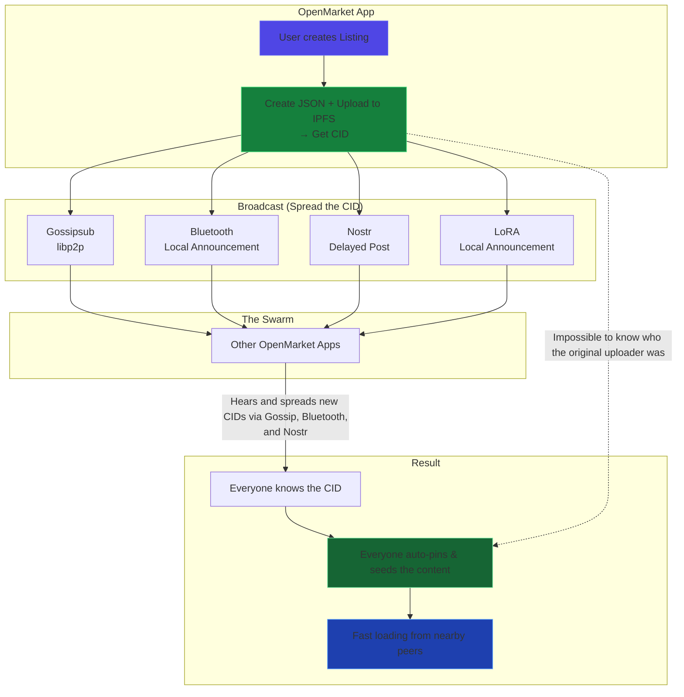

# OpenMarket
A fully decentralized, uncensorable, optionally anonymous marketplace that can’t be controlled, stopped, or shut down.

## Get the App
#### [OpenMarket Mobile App]() (coming soon)
#### [OpenMarket Desktop](https://github.com/lukeprofits/OpenMarket-Desktop) (coming soon)

## Tech
<li>IPFS</li>
<li>NOSTR</li>
<li>Monero</li>

## How it Works

